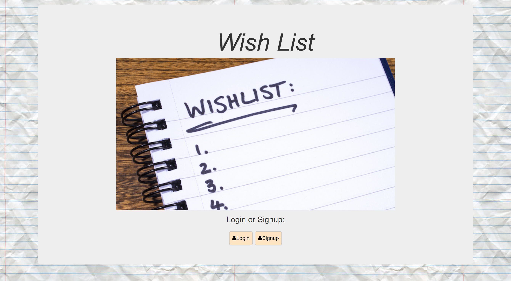

# Full-Stack WishList Application

### Goal: Create a fullstack Javascript web application that allows users to signup, login, and post their wish list items. Must be connected to a Node.js server and a MongoDB database. 

*Project completed using HTML, CSS, Javascript, Node.js, Express.js, and MongoDB.*

## Installation

1. Clone repo
2. run `npm install`

## Usage

1. run `node server.js`
2. Navigate to `localhost:8080`

## Credit

Modified from Scotch.io's auth tutorial
